# Antigravity Academic Skills

**Advanced AI-Assisted Academic Workflow for Finance & Quantitative Research**

This repository contains a modular system of "skills" designed to automate, streamline, and standardize the process of high-level academic research. It is built to operate with agentic AI workflows but provides standalone Python tools for rigorous document processing.

## 🎯 Core Focus: Finance & AI
*   **British English**: All outputs are strictly in formal British English.
*   **Harvard Citations**: Strict adherence to Harvard formatting.
*   **Source Quality**: Prioritizes Q1/Q2 Peer-Reviewed Journals.

> **Customization**: Edit [`skills/academic-standards/SKILL.md`](skills/academic-standards/SKILL.md).

---

## � Scenario-Based Usage Guides

Choose the workflow that matches your current goal.

### 🔍 Situation 1: "I need to find papers on a topic"
**Goal**: Rapidly gather high-quality sources without reading everything.

1.  **Search & Retrieve**:
    ```bash
    # Check Unpaywall, Google Scholar, and Archives
    python skills/literature-review/scripts/retrieve_paper.py "FlashAttention mechanisms"
    ```
2.  **Download Specific Paper**:
    ```bash
    # Downloads and auto-renames to "Author et al. - Year - Title.pdf"
    python skills/literature-review/scripts/download_paper.py "https://arxiv.org/pdf/2205.14135" --author "Dao" --year "2022" --title "FlashAttention"
    ```
3.  **Find Related Work**:
    *   Use `traversing-citations` to find what papers cite this one.

---

### � Situation 2: "I need to understand complex papers"
**Goal**: Deep synthesis and Q&A over difficult technical documents.

1.  **Setup NotebookLM**:
    ```bash
    # Opens browser for one-time Google login
    python skills/notebooklm-skill/scripts/run.py auth_manager.py setup
    ```
2.  **Upload & Query**:
    *   Use the `notebooklm-skill` to upload your downloaded PDFs.
    *   Run query:
        ```bash
        python skills/notebooklm-skill/scripts/run.py ask_question.py --question "Explain the memory complexity reduction in simple terms"
        ```

---

### 📝 Situation 3: "I am writing a paper"
**Goal**: Produce a manuscript that meets strict academic standards.

1.  **Drafting**:
    *   Consult `skills/academic-standards/SKILL.md` for required phrases and formatting.
2.  **Citation Management**:
    *   Ensure all references are in your `.bib` file.
3.  **Compilation**:
    ```bash
    # Compiles LaTeX to PDF
    python skills/latex-manual/scripts/compile_latex.py main.tex
    ```

---

### � Situation 4: "I want the Full Research Lifecycle"
**Goal**: From idea to final PDF.

1.  **Initialize**: `python skills/planning-with-files/scripts/init_session.py` (Creates `task_plan.md`)
2.  **Retrieve**: Run `retrieve_paper.py` to populate your reading list.
3.  **Analyze**: Use `download_paper.py` to get texts.
4.  **Synthesize**: Summarize findings in `findings.md`.
5.  **Write**: Draft in LaTeX using `academic-writing` templates.
6.  **Verify**: Run `check_complete.py task_plan.md`.

---

## 🛠️ Tool Usage & Setup

### Prerequisites
*   Python 3.10+
*   `uv` (dependency manager)

### Quick Start
```bash
# 1. Create Environment
uv venv .venv
.venv\Scripts\activate

# 2. Install Dependencies
uv pip install -r requirements.txt
```

### 🔄 Tool Integration Matrix

| Primary Skill | Integrates With | Purpose |
| :--- | :--- | :--- |
| **literature-review** | `notebooklm-skill` | Send retrieved PDFs for deep Q&A / Synthesis. |
| **literature-review** | `web-research` | Verify paper claims via live browser search. |
| **academic-writing** | `academic-standards` | Enforce British English and Harvard Citation style. |
| **academic-writing** | `latex-manual` | Convert drafts into formatted PDF manuscripts. |
| **web-research** | `browser_subagent` | Navigate complex/JS-heavy financial dashboards. |
| **traversing-citations** | `literature-review` | Find forward/backward references for a key paper. |

---

## 🔄 System Visual

```mermaid
graph TD
    %% Nodes
    Plan[("📝 Planning")]
    Search[("🔍 Retrieval")]
    Analyze[("🧠 Analysis")]
    Synth[("🤖 Synthesis")]
    Write[("✍️ Writing")]

    %% Flow
    Plan -->|Define Topic| Search
    Search -->|Found Papers| Analyze
    Analyze -->|Extracted Text| Synth
    Synth -->|Key Insights| Write
```


