# Antigravity Academic Skills

**Advanced AI-Assisted Academic Workflow for Finance & Quantitative Research**

This repository contains a modular system of "skills" designed to automate, streamline, and standardize the process of high-level academic research. It is built to operate with agentic AI workflows but provides standalone Python tools for rigorous document processing.

## 🎯 Core Focus: Finance & AI
This project is optimized for research in:
- **Artificial Intelligence** (Transformers, LLMs, RL)
- **Quantitative Finance** (Algorithmic Trading, Market Microstructure)
- **Asset Pricing & Risk Management**

### 🇬🇧 Standardization
*   **British English**: All outputs are strictly in formal British English (e.g., *analyse*, *behaviour*, *modelling*).
*   **Harvard Citations**: Strict adherence to Harvard formatting for citations and references.
*   **Source Quality**: Prioritizes Q1/Q2 Peer-Reviewed Journals and high-impact ArXiv preprints.

> **Customization**: To change these defaults (e.g., to US English or APA style), edit the **Single Source of Truth** file: [`skills/academic-standards/SKILL.md`](skills/academic-standards/SKILL.md).

---

## 🔄 Workflow & Integration

### System Architecture

```mermaid
graph TD
    %% Nodes
    Plan[("📝 Planning<br>(planning-with-files)")]
    Standards[("⚖️ Academic Standards<br>(Rules Engine)")]
    Search[("🔍 Retrieval<br>(literature-review)")]
    Analyze[("🧠 Analysis<br>(web-research / Download)")]
    Synth[("🤖 Synthesis<br>(notebooklm-skill)")]
    Write[("✍️ Writing<br>(academic-writing)")]
    Output[("📄 Latex Output<br>(latex-manual)")]

    %% Styles
    style Standards fill:#f9f,stroke:#333,stroke-width:4px
    style Synth fill:#ff9,stroke:#333,stroke-width:2px

    %% Flow
    Plan --> Search
    Search --> Analyze
    Analyze --> Synth
    Synth --> Write
    Write --> Output

    %% Guidance
    Standards -.-o Plan
    Standards -.-o Write
    Standards -.-o Search
```



### 🧩 Tool Integration Matrix

This table shows which skills are designed to work together directly.

| Primary Skill | Integrates With | Purpose |
| :--- | :--- | :--- |
| **literature-review** | `notebooklm-skill` | Send retrieved PDFs for deep Q&A / Synthesis. |
| **literature-review** | `web-research` | Verify paper claims via live browser search. |
| **academic-writing** | `academic-standards` | Enforce British English and Harvard Citation style. |
| **academic-writing** | `latex-manual` | Convert drafts into formatted PDF manuscripts. |
| **web-research** | `browser_subagent` | Navigate complex/JS-heavy financial dashboards. |

### 📝 Detailed Step-by-Step Workflow

1.  **Planning** (`planning-with-files`):
    - Initialize a session: `python skills/planning-with-files/scripts/init_session.py`
    - Creates `task_plan.md` to track progress.

2.  **Retrieval** (`literature-review`):
    - Find papers: `python skills/literature-review/scripts/retrieve_paper.py "Paper Title"`
    - Checks Unpaywall, Google Scholar, and Anna's Archive.

3.  **Acquisition & Analysis** (`literature-review`):
    - **Online**: AI Agent browses and reads abstracts/PDFs.
    - **Offline**: Download & Parse:
        ```bash
        python skills/literature-review/scripts/download_paper.py "URL" --author "Author" --year "2024" --title "Title"
        ```
        - Automatically names files: `Author et al. - Year - Title.pdf`.
        - Extracts text immediately for synthesis.

4.  **Synthesis** (`notebooklm-skill`):
    - Uploads complex documents to Google NotebookLM for deep interrogation.
    - Run: `python skills/notebooklm-skill/scripts/run.py ...`

5.  **Writing** (`academic-writing` & `latex-manual`):
    - Draft content following `academic-standards`.
    - Compile LaTeX: `python skills/latex-manual/scripts/compile_latex.py main.tex`

---

## 🛠️ Tool Usage

### Prerequisites
*   Python 3.10+
*   `uv` (for dependency management)
*   Google Chrome (for NotebookLM)

### Setup
```bash
# Create and activate environment
uv venv .venv
.venv\Scripts\activate

# Install dependencies
uv pip install -r requirements.txt
```

### Key Scripts

| Task | Command |
|------|---------|
| **Retrieve Paper** | `python skills/literature-review/scripts/retrieve_paper.py "Title"` |
| **Download PDF** | `python skills/literature-review/scripts/download_paper.py "URL" --author "Name" ...` |
| **Check Progress**| `python skills/planning-with-files/scripts/check_complete.py task_plan.md` |
| **NotebookLM** | `python skills/notebooklm-skill/scripts/run.py auth_manager.py setup` |

---

## 📁 Repository Structure

*   `skills/academic-standards/`: **Rules engine** for style and quality.
*   `skills/literature-review/`: Tools for finding and analyzing papers.
*   `skills/notebooklm-skill/`: AI-powered deep synthesis.
*   `skills/planning-with-files/`: Session management and tracking.
*   `skills/latex-manual/`: LaTeX compilation and bibtex tools.
*   `skills/web-research/`: Browser-based research navigation.

---

## 🔄 Integration

This system is designed to work with AI Agents.
- **Agents** read `SKILL.md` in each directory to understand capabilities.
- **Humans** use the Python scripts for reliable, reproducible actions.
